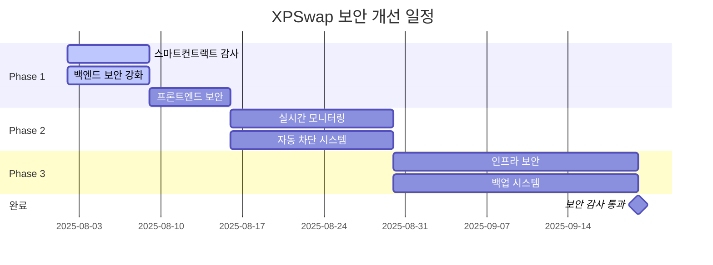

# 🔐 XPSwap 보안 개선 계획서 2025

## 📋 개요

**문서 버전**: v1.0  
**작성일**: 2025년 8월 2일  
**최종 업데이트**: 2025년 8월 2일  
**담당**: XPSwap 개발팀  
**우선순위**: HIGH (보안은 DeFi 플랫폼의 생명선)

이 문서는 XPSwap DeFi 플랫폼의 보안을 전면적으로 강화하기 위한 종합 계획서입니다. 스마트 컨트랙트부터 프론트엔드, 백엔드, 인프라까지 모든 계층의 보안을 다룹니다.

---

## 🎯 보안 목표

### 핵심 보안 원칙
1. **Zero Trust Architecture**: 모든 요청을 검증
2. **Defense in Depth**: 다층 보안 구조
3. **Fail Secure**: 실패 시 안전한 상태 유지
4. **Least Privilege**: 최소 권한 원칙
5. **Transparency**: 보안 상태 투명 공개

### 목표 메트릭
- **보안 사고**: 0건 유지
- **취약점 해결 시간**: 24시간 이내 (Critical), 7일 이내 (High)
- **보안 테스트 커버리지**: 90% 이상
- **감사 통과율**: 100%
- **사용자 자금 손실**: 0원

---

## 📊 현재 보안 상태 분석

### ✅ 현재 구현된 보안 기능

#### 백엔드 보안
- **Helmet.js**: HTTP 헤더 보안 강화
- **CORS**: 크로스 오리진 요청 제어
- **Rate Limiting**: API 호출 속도 제한
- **Input Validation**: 입력값 검증 및 살균
- **SQL Injection 방지**: 매개변수화된 쿼리 사용
- **XSS 방지**: 출력 인코딩 적용

#### 프론트엔드 보안
- **CSP (Content Security Policy)**: 인라인 스크립트 차단
- **ErrorBoundary**: 전역 에러 처리
- **Secure 통신**: HTTPS 강제 사용
- **토큰 검증**: 지갑 연결 상태 확인

#### DeFi 특화 보안
- **MEV Protection**: 최대 추출 가능 가치 보호
- **Slippage Protection**: 슬리피지 제한
- **Contract Verification**: 스마트 컨트랙트 검증

### ⚠️ 현재 보안 취약점

#### HIGH 우선순위
1. **스마트 컨트랙트 미감사**: 외부 감사 필요
2. **Private Key 관리**: 하드웨어 보안 모듈(HSM) 미사용
3. **Multi-Sig 부재**: 단일 관리자 키 의존
4. **Flash Loan 공격 방어**: 불완전한 보호
5. **Oracle 조작 방어**: 단일 가격 오라클 의존

#### MEDIUM 우선순위
1. **Session 관리**: JWT 토큰 보안 강화 필요
2. **API Rate Limiting**: 더 정교한 제한 필요
3. **로깅 보안**: 민감 정보 로깅 방지
4. **데이터베이스 암호화**: 미암호화 상태
5. **백업 보안**: 암호화되지 않은 백업

#### LOW 우선순위
1. **보안 헤더 최적화**: 추가 헤더 적용
2. **펜테스트**: 정기적인 침투 테스트 미실시
3. **보안 모니터링**: 실시간 위협 탐지 부재
4. **사용자 교육**: 보안 가이드 부족

---

## 🛡️ 스마트 컨트랙트 보안 강화

### Phase 1: 감사 및 검증 (즉시 시행)

#### 1.1 코드 감사
```solidity
// 현재 구현된 컨트랙트 검토 필요
contracts/
├── XPSwapDEX.sol      # 메인 DEX 컨트랙트
├── LiquidityPool.sol  # 유동성 풀
├── YieldFarm.sol      # 수익률 파밍
├── CrossChain.sol     # 크로스체인 브릿지
└── Governance.sol     # 거버넌스
```

**감사 체크리스트:**
- [ ] 재진입 공격 방어 (ReentrancyGuard)
- [ ] 정수 오버플로우/언더플로우 방지
- [ ] 접근 제어 적절성 검증
- [ ] 가스 최적화 및 DoS 방어
- [ ] 타임스탬프 의존성 제거
- [ ] 외부 호출 안전성 검증

#### 1.2 자동화된 보안 도구
```bash
# Slither - 정적 분석
pip install slither-analyzer
slither contracts/XPSwapDEX.sol

# Mythril - 심볼릭 실행
pip install mythril
myth analyze contracts/XPSwapDEX.sol

# Echidna - 퍼즈 테스트
echidna-test contracts/XPSwapDEX.sol
```

### Phase 2: 고급 보안 패턴 구현 (1주 내)

#### 2.1 다중 서명 지갑 구현
```solidity
// MultiSigWallet.sol
contract MultiSigWallet {
    uint public required;
    address[] public owners;
    
    modifier onlyWallet() {
        require(msg.sender == address(this));
        _;
    }
    
    modifier ownerExists(address owner) {
        require(isOwner[owner]);
        _;
    }
    
    // 3-of-5 멀티시그 권장
    constructor(address[] memory _owners, uint _required) {
        require(_owners.length >= 3 && _required >= 2);
        // 구현 로직
    }
}
```

#### 2.2 타임락 구현
```solidity
// TimeLock.sol
contract TimeLock {
    uint public constant MINIMUM_DELAY = 2 days;
    uint public constant MAXIMUM_DELAY = 30 days;
    
    mapping(bytes32 => bool) public queuedTransactions;
    
    function queueTransaction(
        address target,
        uint value,
        string memory signature,
        bytes memory data,
        uint eta
    ) public returns (bytes32) {
        require(eta >= getBlockTimestamp() + MINIMUM_DELAY);
        // 구현 로직
    }
}
```

#### 2.3 가격 오라클 보안
```solidity
// PriceOracle.sol
contract PriceOracle {
    struct PriceData {
        uint256 price;
        uint256 timestamp;
        bool isValid;
    }
    
    mapping(address => PriceData[]) public priceHistory;
    uint256 public constant PRICE_DEVIATION_THRESHOLD = 500; // 5%
    
    function getSecurePrice(address token) external view returns (uint256) {
        // TWAP (Time-Weighted Average Price) 구현
        // 복수 오라클 데이터 검증
        // 이상치 탐지 및 필터링
    }
}
```

### Phase 3: Flash Loan 공격 방어 (2주 내)

#### 3.1 Flash Loan 탐지
```solidity
// FlashLoanDefender.sol
contract FlashLoanDefender {
    mapping(address => uint256) private balanceSnapshots;
    
    modifier flashLoanProtection() {
        uint256 balanceBefore = address(this).balance;
        _;
        require(
            address(this).balance >= balanceBefore,
            "Flash loan attack detected"
        );
    }
    
    function detectArbitrage() internal view returns (bool) {
        // 단일 트랜잭션 내 대량 거래 탐지
        // 비정상적인 가격 변동 감지
        // MEV 봇 패턴 인식
    }
}
```

---

## 🔒 백엔드 보안 강화

### Phase 1: 인증 및 권한 관리 강화 (즉시 시행)

#### 1.1 JWT 보안 강화
```typescript
// server/middleware/auth.ts
import jwt from 'jsonwebtoken';
import rateLimit from 'express-rate-limit';

const JWT_CONFIG = {
    algorithm: 'RS256', // 비대칭 키 사용
    expiresIn: '15m',   // 짧은 만료 시간
    issuer: 'xpswap.io',
    audience: 'xpswap-api'
};

// Refresh Token 구현
const authLimiter = rateLimit({
    windowMs: 15 * 60 * 1000, // 15분
    max: 5, // 최대 5회 인증 시도
    message: 'Too many authentication attempts'
});

export const verifyToken = (req: Request, res: Response, next: NextFunction) => {
    const token = req.headers.authorization?.split(' ')[1];
    
    if (!token) {
        return res.status(401).json({ error: 'Access token required' });
    }
    
    try {
        const decoded = jwt.verify(token, process.env.JWT_PUBLIC_KEY!, JWT_CONFIG);
        req.user = decoded;
        next();
    } catch (error) {
        if (error.name === 'TokenExpiredError') {
            return res.status(401).json({ error: 'Token expired' });
        }
        return res.status(403).json({ error: 'Invalid token' });
    }
};
```

#### 1.2 API Rate Limiting 고도화
```typescript
// server/middleware/rateLimiter.ts
import RedisStore from 'rate-limit-redis';
import Redis from 'ioredis';

const redis = new Redis(process.env.REDIS_URL);

// 계층화된 Rate Limiting
export const createRateLimit = (windowMs: number, max: number, keyGenerator?: Function) => {
    return rateLimit({
        store: new RedisStore({
            client: redis,
            prefix: 'rl:',
        }),
        windowMs,
        max,
        keyGenerator: keyGenerator || ((req) => req.ip),
        standardHeaders: true,
        legacyHeaders: false,
        handler: (req, res) => {
            res.status(429).json({
                error: 'Too many requests',
                retryAfter: Math.round(windowMs / 1000)
            });
        }
    });
};

// 용도별 Rate Limit
export const tradingLimit = createRateLimit(60 * 1000, 10); // 거래: 1분에 10회
export const priceLimit = createRateLimit(5 * 1000, 20);   // 가격: 5초에 20회
export const authLimit = createRateLimit(15 * 60 * 1000, 5); // 인증: 15분에 5회
```

### Phase 2: 데이터 보안 강화 (1주 내)

#### 2.1 데이터베이스 암호화
```typescript
// server/db/encryption.ts
import crypto from 'crypto';
import bcrypt from 'bcrypt';

const ENCRYPTION_KEY = process.env.DB_ENCRYPTION_KEY!;
const ALGORITHM = 'aes-256-gcm';

export class DataEncryption {
    static encrypt(text: string): string {
        const iv = crypto.randomBytes(16);
        const cipher = crypto.createCipher(ALGORITHM, ENCRYPTION_KEY);
        cipher.setAAD(Buffer.from('XPSwap-2025'));
        
        let encrypted = cipher.update(text, 'utf8', 'hex');
        encrypted += cipher.final('hex');
        
        const authTag = cipher.getAuthTag();
        return `${iv.toString('hex')}:${authTag.toString('hex')}:${encrypted}`;
    }
    
    static decrypt(encryptedData: string): string {
        const [ivHex, authTagHex, encrypted] = encryptedData.split(':');
        const iv = Buffer.from(ivHex, 'hex');
        const authTag = Buffer.from(authTagHex, 'hex');
        
        const decipher = crypto.createDecipher(ALGORITHM, ENCRYPTION_KEY);
        decipher.setAAD(Buffer.from('XPSwap-2025'));
        decipher.setAuthTag(authTag);
        
        let decrypted = decipher.update(encrypted, 'hex', 'utf8');
        decrypted += decipher.final('utf8');
        return decrypted;
    }
    
    // 민감 데이터 해싱
    static async hashSensitiveData(data: string): Promise<string> {
        const saltRounds = 12;
        return await bcrypt.hash(data, saltRounds);
    }
}
```

#### 2.2 보안 로깅 시스템
```typescript
// server/middleware/securityLogger.ts
import winston from 'winston';
import DailyRotateFile from 'winston-daily-rotate-file';

const securityLogger = winston.createLogger({
    level: 'info',
    format: winston.format.combine(
        winston.format.timestamp(),
        winston.format.errors({ stack: true }),
        winston.format.json()
    ),
    transports: [
        new DailyRotateFile({
            filename: 'logs/security-%DATE%.log',
            datePattern: 'YYYY-MM-DD',
            maxFiles: '30d',
            maxSize: '100m'
        })
    ]
});

export const logSecurityEvent = (event: {
    type: 'AUTH_FAILURE' | 'RATE_LIMIT' | 'SUSPICIOUS_ACTIVITY' | 'SQL_INJECTION_ATTEMPT';
    ip: string;
    userAgent?: string;
    details: any;
    severity: 'LOW' | 'MEDIUM' | 'HIGH' | 'CRITICAL';
}) => {
    securityLogger.warn('Security Event', {
        ...event,
        timestamp: new Date().toISOString(),
        sessionId: crypto.randomUUID()
    });
    
    // Critical 이벤트는 즉시 알림
    if (event.severity === 'CRITICAL') {
        // Slack/Discord 웹훅 또는 이메일 알림
        sendImmediateAlert(event);
    }
};
```

### Phase 3: API 보안 강화 (2주 내)

#### 3.1 입력 검증 및 살균
```typescript
// server/middleware/validation.ts
import Joi from 'joi';
import DOMPurify from 'isomorphic-dompurify';
import { Request, Response, NextFunction } from 'express';

const schemas = {
    swapRequest: Joi.object({
        fromToken: Joi.string().pattern(/^0x[a-fA-F0-9]{40}$/).required(),
        toToken: Joi.string().pattern(/^0x[a-fA-F0-9]{40}$/).required(),
        amount: Joi.string().pattern(/^\d+(\.\d+)?$/).required(),
        slippage: Joi.number().min(0.1).max(50).required(),
        deadline: Joi.number().integer().min(Date.now()).required()
    }),
    
    liquidityRequest: Joi.object({
        tokenA: Joi.string().pattern(/^0x[a-fA-F0-9]{40}$/).required(),
        tokenB: Joi.string().pattern(/^0x[a-fA-F0-9]{40}$/).required(),
        amountA: Joi.string().pattern(/^\d+(\.\d+)?$/).required(),
        amountB: Joi.string().pattern(/^\d+(\.\d+)?$/).required()
    })
};

export const validateInput = (schemaName: keyof typeof schemas) => {
    return (req: Request, res: Response, next: NextFunction) => {
        const schema = schemas[schemaName];
        const { error, value } = schema.validate(req.body);
        
        if (error) {
            logSecurityEvent({
                type: 'SUSPICIOUS_ACTIVITY',
                ip: req.ip,
                details: { validationError: error.details },
                severity: 'MEDIUM'
            });
            
            return res.status(400).json({
                error: 'Invalid input',
                details: error.details.map(d => d.message)
            });
        }
        
        // HTML/Script 태그 제거
        req.body = sanitizeObject(value);
        next();
    };
};

const sanitizeObject = (obj: any): any => {
    if (typeof obj === 'string') {
        return DOMPurify.sanitize(obj, { ALLOWED_TAGS: [] });
    }
    if (typeof obj === 'object' && obj !== null) {
        const sanitized: any = {};
        for (const [key, value] of Object.entries(obj)) {
            sanitized[key] = sanitizeObject(value);
        }
        return sanitized;
    }
    return obj;
};
```

---

## 🖥️ 프론트엔드 보안 강화

### Phase 1: 클라이언트 사이드 보안 (즉시 시행)

#### 1.1 Content Security Policy 강화
```typescript
// client/src/security/csp.ts
const CSP_CONFIG = {
    'default-src': ["'self'"],
    'script-src': [
        "'self'",
        "'unsafe-inline'", // 개발 중에만 허용, 프로덕션에서 제거
        'https://cdn.jsdelivr.net',
        'https://unpkg.com'
    ],
    'style-src': [
        "'self'",
        "'unsafe-inline'",
        'https://fonts.googleapis.com'
    ],
    'img-src': [
        "'self'",
        'data:',
        'https:',
        'blob:'
    ],
    'connect-src': [
        "'self'",
        'https://api.coingecko.com',
        'https://www.ankr.com',
        'wss://ethereum-mainnet.ws.alchemyapi.io'
    ],
    'font-src': [
        "'self'",
        'https://fonts.gstatic.com'
    ],
    'frame-src': ["'none'"],
    'object-src': ["'none'"],
    'base-uri': ["'self'"],
    'form-action': ["'self'"]
};

export const generateCSPHeader = (): string => {
    return Object.entries(CSP_CONFIG)
        .map(([directive, sources]) => `${directive} ${sources.join(' ')}`)
        .join('; ');
};
```

#### 1.2 XSS 방어 강화
```typescript
// client/src/utils/sanitization.ts
import DOMPurify from 'dompurify';

export const sanitizeHTML = (dirty: string): string => {
    return DOMPurify.sanitize(dirty, {
        ALLOWED_TAGS: ['b', 'i', 'em', 'strong', 'p', 'br'],
        ALLOWED_ATTR: [],
        ALLOW_DATA_ATTR: false
    });
};

export const sanitizeUserInput = (input: string): string => {
    return input
        .replace(/[<>'"&]/g, (char) => {
            const map: { [key: string]: string } = {
                '<': '&lt;',
                '>': '&gt;',
                '"': '&quot;',
                "'": '&#x27;',
                '&': '&amp;'
            };
            return map[char];
        });
};

// React 컴포넌트에서 사용
export const SafeHTML: React.FC<{ html: string }> = ({ html }) => {
    return (
        <div 
            dangerouslySetInnerHTML={{ 
                __html: sanitizeHTML(html) 
            }} 
        />
    );
};
```

### Phase 2: 지갑 연결 보안 (1주 내)

#### 2.1 지갑 검증 강화
```typescript
// client/src/security/walletSecurity.ts
import { ethers } from 'ethers';

export class WalletSecurity {
    private static readonly TRUSTED_WALLETS = [
        'MetaMask',
        'WalletConnect',
        'Coinbase Wallet',
        'Trust Wallet'
    ];
    
    static async verifyWalletConnection(provider: any): Promise<boolean> {
        try {
            // 지갑 유형 검증
            if (!this.isTrustedWallet(provider)) {
                throw new Error('Untrusted wallet detected');
            }
            
            // 네트워크 검증
            const network = await provider.getNetwork();
            if (network.chainId !== parseInt(process.env.VITE_CHAIN_ID!)) {
                throw new Error('Wrong network');
            }
            
            // 계정 접근 권한 확인
            const accounts = await provider.listAccounts();
            if (accounts.length === 0) {
                throw new Error('No accounts available');
            }
            
            return true;
        } catch (error) {
            console.error('Wallet verification failed:', error);
            return false;
        }
    }
    
    static isTrustedWallet(provider: any): boolean {
        const walletName = provider.connection?.url || provider.isMetaMask ? 'MetaMask' : 'Unknown';
        return this.TRUSTED_WALLETS.includes(walletName);
    }
    
    static async signSecurityChallenge(provider: any, address: string): Promise<string> {
        const message = `XPSwap Security Challenge: ${Date.now()}`;
        const signature = await provider.getSigner().signMessage(message);
        
        // 서명 검증
        const recoveredAddress = ethers.utils.verifyMessage(message, signature);
        if (recoveredAddress.toLowerCase() !== address.toLowerCase()) {
            throw new Error('Signature verification failed');
        }
        
        return signature;
    }
}
```

#### 2.2 트랜잭션 보안
```typescript
// client/src/security/transactionSecurity.ts
export class TransactionSecurity {
    static validateTransaction(tx: any): boolean {
        // 가스 가격 검증 (비정상적으로 높은 가스 방지)
        if (tx.gasPrice && ethers.utils.formatUnits(tx.gasPrice, 'gwei') > '500') {
            throw new Error('Gas price too high');
        }
        
        // 수신자 주소 검증
        if (!ethers.utils.isAddress(tx.to)) {
            throw new Error('Invalid recipient address');
        }
        
        // 금액 검증 (의심스러운 대량 거래)
        if (tx.value && ethers.utils.formatEther(tx.value) > '1000') {
            return confirm('Large transaction detected. Are you sure?');
        }
        
        return true;
    }
    
    static estimateGasSafely(contract: any, method: string, params: any[]): Promise<ethers.BigNumber> {
        return contract.estimateGas[method](...params)
            .then((estimate: ethers.BigNumber) => {
                // 10% 버퍼 추가
                return estimate.mul(110).div(100);
            })
            .catch((error: any) => {
                console.error('Gas estimation failed:', error);
                throw new Error('Transaction simulation failed');
            });
    }
}
```

### Phase 3: 클라이언트 모니터링 (2주 내)

#### 3.1 보안 이벤트 모니터링
```typescript
// client/src/security/monitoring.ts
class SecurityMonitor {
    private static instance: SecurityMonitor;
    private events: SecurityEvent[] = [];
    
    static getInstance(): SecurityMonitor {
        if (!SecurityMonitor.instance) {
            SecurityMonitor.instance = new SecurityMonitor();
        }
        return SecurityMonitor.instance;
    }
    
    logEvent(event: SecurityEvent): void {
        this.events.push({
            ...event,
            timestamp: Date.now(),
            sessionId: this.getSessionId()
        });
        
        // Critical 이벤트는 서버로 즉시 전송
        if (event.severity === 'CRITICAL') {
            this.sendToServer(event);
        }
        
        // 로컬 저장소에 저장 (암호화)
        this.persistEvents();
    }
    
    private sendToServer(event: SecurityEvent): void {
        fetch('/xpswap/api/security/report', {
            method: 'POST',
            headers: { 'Content-Type': 'application/json' },
            body: JSON.stringify(event)
        }).catch(error => {
            console.error('Failed to report security event:', error);
        });
    }
    
    // 의심스러운 활동 탐지
    detectSuspiciousActivity(): void {
        // 빠른 연속 거래 시도
        const recentTrades = this.events.filter(e => 
            e.type === 'TRADE_ATTEMPT' && 
            Date.now() - e.timestamp < 10000 // 10초 내
        );
        
        if (recentTrades.length > 5) {
            this.logEvent({
                type: 'SUSPICIOUS_ACTIVITY',
                details: 'Rapid trading attempts detected',
                severity: 'HIGH'
            });
        }
        
        // 개발자 도구 감지
        this.detectDevTools();
    }
    
    private detectDevTools(): void {
        const devtools = {
            open: false,
            orientation: null
        };
        
        setInterval(() => {
            if (window.outerHeight - window.innerHeight > 200 ||
                window.outerWidth - window.innerWidth > 200) {
                if (!devtools.open) {
                    devtools.open = true;
                    this.logEvent({
                        type: 'DEV_TOOLS_DETECTED',
                        details: 'Developer tools opened',
                        severity: 'MEDIUM'
                    });
                }
            } else {
                devtools.open = false;
            }
        }, 1000);
    }
}

interface SecurityEvent {
    type: 'TRADE_ATTEMPT' | 'WALLET_CONNECT' | 'SUSPICIOUS_ACTIVITY' | 'DEV_TOOLS_DETECTED';
    details: string;
    severity: 'LOW' | 'MEDIUM' | 'HIGH' | 'CRITICAL';
    timestamp?: number;
    sessionId?: string;
}
```

---

## 🚨 실시간 보안 모니터링

### Phase 1: 위협 탐지 시스템 (1주 내)

#### 1.1 실시간 알림 시스템
```typescript
// server/security/alertSystem.ts
import { WebClient } from '@slack/web-api';
import nodemailer from 'nodemailer';

export class AlertSystem {
    private slack: WebClient;
    private emailTransporter: nodemailer.Transporter;
    
    constructor() {
        this.slack = new WebClient(process.env.SLACK_BOT_TOKEN);
        this.emailTransporter = nodemailer.createTransporter({
            service: 'gmail',
            auth: {
                user: process.env.ALERT_EMAIL,
                pass: process.env.ALERT_EMAIL_PASSWORD
            }
        });
    }
    
    async sendCriticalAlert(event: SecurityEvent): Promise<void> {
        const message = this.formatAlertMessage(event);
        
        // Slack 알림
        await this.slack.chat.postMessage({
            channel: '#security-alerts',
            text: `🚨 CRITICAL SECURITY ALERT`,
            blocks: [
                {
                    type: 'section',
                    text: {
                        type: 'mrkdwn',
                        text: message
                    }
                },
                {
                    type: 'actions',
                    elements: [
                        {
                            type: 'button',
                            text: {
                                type: 'plain_text',
                                text: 'Investigate'
                            },
                            url: `${process.env.ADMIN_DASHBOARD_URL}/security/events/${event.id}`
                        }
                    ]
                }
            ]
        });
        
        // 이메일 알림
        await this.emailTransporter.sendMail({
            from: process.env.ALERT_EMAIL,
            to: process.env.ADMIN_EMAILS,
            subject: `🚨 XPSwap Security Alert - ${event.type}`,
            html: this.generateEmailTemplate(event)
        });
    }
    
    private formatAlertMessage(event: SecurityEvent): string {
        return `
*Event Type:* ${event.type}
*Severity:* ${event.severity}
*Time:* ${new Date(event.timestamp).toISOString()}
*IP Address:* ${event.ip}
*Details:* ${JSON.stringify(event.details, null, 2)}
        `.trim();
    }
}
```

#### 1.2 자동 차단 시스템
```typescript
// server/security/autoBlock.ts
import Redis from 'ioredis';

export class AutoBlockSystem {
    private redis: Redis;
    private readonly BLOCK_DURATION = {
        'LOW': 5 * 60,      // 5분
        'MEDIUM': 30 * 60,  // 30분
        'HIGH': 2 * 60 * 60, // 2시간
        'CRITICAL': 24 * 60 * 60 // 24시간
    };
    
    constructor() {
        this.redis = new Redis(process.env.REDIS_URL);
    }
    
    async blockIP(ip: string, severity: string, reason: string): Promise<void> {
        const blockKey = `blocked:${ip}`;
        const duration = this.BLOCK_DURATION[severity as keyof typeof this.BLOCK_DURATION] || 300;
        
        await this.redis.setex(blockKey, duration, JSON.stringify({
            reason,
            severity,
            blockedAt: Date.now(),
            expiresAt: Date.now() + (duration * 1000)
        }));
        
        // 차단 이벤트 로그
        console.log(`IP ${ip} blocked for ${duration}s - Reason: ${reason}`);
    }
    
    async isBlocked(ip: string): Promise<boolean> {
        const blockData = await this.redis.get(`blocked:${ip}`);
        return blockData !== null;
    }
    
    async getBlockInfo(ip: string): Promise<any> {
        const blockData = await this.redis.get(`blocked:${ip}`);
        return blockData ? JSON.parse(blockData) : null;
    }
    
    // 미들웨어로 사용
    middleware() {
        return async (req: Request, res: Response, next: NextFunction) => {
            const ip = req.ip;
            
            if (await this.isBlocked(ip)) {
                const blockInfo = await this.getBlockInfo(ip);
                return res.status(403).json({
                    error: 'Access denied',
                    reason: 'IP address temporarily blocked',
                    expiresAt: blockInfo.expiresAt
                });
            }
            
            next();
        };
    }
}
```

### Phase 2: 행동 분석 (2주 내)

#### 2.1 사용자 행동 패턴 분석
```typescript
// server/security/behaviorAnalysis.ts
export class BehaviorAnalysis {
    private patterns = new Map();
    
    analyzeRequest(req: Request): ThreatScore {
        const userFingerprint = this.generateFingerprint(req);
        const currentPattern = this.getCurrentPattern(req);
        
        let threatScore = 0;
        
        // 1. 요청 빈도 분석
        const frequency = this.getRequestFrequency(userFingerprint);
        if (frequency > 100) { // 1분에 100회 이상
            threatScore += 50;
        }
        
        // 2. 비정상적인 엔드포인트 접근
        const sensitiveEndpoints = ['/admin', '/debug', '/api/internal'];
        if (sensitiveEndpoints.some(endpoint => req.path.includes(endpoint))) {
            threatScore += 75;
        }
        
        // 3. SQL Injection 시도 탐지
        const sqlPatterns = /(\b(union|select|drop|delete|insert|update)\b|['";])/i;
        const queryString = JSON.stringify(req.query) + JSON.stringify(req.body);
        if (sqlPatterns.test(queryString)) {
            threatScore += 100;
        }
        
        // 4. User-Agent 분석
        const ua = req.headers['user-agent'] || '';
        if (this.isSuspiciousUserAgent(ua)) {
            threatScore += 30;
        }
        
        // 5. 지리적 위치 급변
        if (this.detectLocationJumping(userFingerprint, req.ip)) {
            threatScore += 40;
        }
        
        return {
            score: threatScore,
            level: this.getThreatLevel(threatScore),
            details: this.getAnalysisDetails(currentPattern)
        };
    }
    
    private isSuspiciousUserAgent(ua: string): boolean {
        const suspiciousPatterns = [
            'bot', 'crawler', 'spider', 'scraper',
            'curl', 'wget', 'python', 'requests',
            'java', 'apache', 'scanner'
        ];
        
        return suspiciousPatterns.some(pattern => 
            ua.toLowerCase().includes(pattern)
        );
    }
    
    private getThreatLevel(score: number): 'LOW' | 'MEDIUM' | 'HIGH' | 'CRITICAL' {
        if (score >= 100) return 'CRITICAL';
        if (score >= 75) return 'HIGH';
        if (score >= 50) return 'MEDIUM';
        return 'LOW';
    }
}

interface ThreatScore {
    score: number;
    level: 'LOW' | 'MEDIUM' | 'HIGH' | 'CRITICAL';
    details: any;
}
```

---

## 🔐 인프라 보안 강화

### Phase 1: 서버 보안 (즉시 시행)

#### 1.1 Ubuntu 서버 보안 설정
```bash
#!/bin/bash
# server-security-setup.sh

# 1. 시스템 업데이트
apt update && apt upgrade -y

# 2. Fail2ban 설치 및 설정
apt install fail2ban -y
cat > /etc/fail2ban/jail.local << EOF
[DEFAULT]
bantime = 3600
findtime = 600
maxretry = 3

[sshd]
enabled = true
port = ssh
filter = sshd
logpath = /var/log/auth.log
maxretry = 3

[apache-auth]
enabled = true
port = http,https
filter = apache-auth
logpath = /var/log/apache2/error.log
maxretry = 3

[apache-badbots]
enabled = true
port = http,https
filter = apache-badbots
logpath = /var/log/apache2/access.log
maxretry = 2
EOF

# 3. UFW 방화벽 설정
ufw default deny incoming
ufw default allow outgoing
ufw allow ssh
ufw allow 80/tcp
ufw allow 443/tcp
ufw allow 5000/tcp  # XPSwap API
ufw --force enable

# 4. 자동 보안 업데이트
apt install unattended-upgrades -y
dpkg-reconfigure -plow unattended-upgrades

# 5. 로그 모니터링 설정
apt install logwatch -y
echo "Daily = yes" >> /etc/logwatch/conf/logwatch.conf
echo "Output = mail" >> /etc/logwatch/conf/logwatch.conf
echo "Format = html" >> /etc/logwatch/conf/logwatch.conf
echo "MailTo = admin@xpswap.io" >> /etc/logwatch/conf/logwatch.conf
```

#### 1.2 SSL/TLS 강화
```apache
# /etc/apache2/sites-available/xpswap-ssl.conf
<VirtualHost *:443>
    ServerName trendy.storydot.kr
    DocumentRoot /var/www/storage/xpswap/client/dist
    
    # SSL 설정
    SSLEngine on
    SSLCertificateFile /etc/letsencrypt/live/trendy.storydot.kr/fullchain.pem
    SSLCertificateKeyFile /etc/letsencrypt/live/trendy.storydot.kr/privkey.pem
    
    # 보안 헤더
    Header always set Strict-Transport-Security "max-age=31536000; includeSubDomains; preload"
    Header always set X-Content-Type-Options nosniff
    Header always set X-Frame-Options DENY
    Header always set X-XSS-Protection "1; mode=block"
    Header always set Referrer-Policy "strict-origin-when-cross-origin"
    Header always set Permissions-Policy "geolocation=(), microphone=(), camera=()"
    
    # CSP 헤더
    Header always set Content-Security-Policy "default-src 'self'; script-src 'self' 'unsafe-inline' https://cdn.jsdelivr.net; style-src 'self' 'unsafe-inline' https://fonts.googleapis.com; img-src 'self' data: https:; connect-src 'self' https://api.coingecko.com https://www.ankr.com; font-src 'self' https://fonts.gstatic.com"
    
    # SSL 프로토콜/암호화 설정
    SSLProtocol -all +TLSv1.2 +TLSv1.3
    SSLCipherSuite ECDHE-ECDSA-AES128-GCM-SHA256:ECDHE-RSA-AES128-GCM-SHA256:ECDHE-ECDSA-AES256-GCM-SHA384:ECDHE-RSA-AES256-GCM-SHA384
    SSLHonorCipherOrder off
    SSLSessionTickets off
    
    # OCSP Stapling
    SSLUseStapling on
    SSLStaplingResponderTimeout 5
    SSLStaplingReturnResponderErrors off
</VirtualHost>

# HTTP to HTTPS 리다이렉트
<VirtualHost *:80>
    ServerName trendy.storydot.kr
    Redirect permanent / https://trendy.storydot.kr/
</VirtualHost>
```

### Phase 2: 네트워크 보안 (1주 내)

#### 2.1 DDoS 방어
```bash
# /etc/apache2/mods-available/evasive.conf
<IfModule mod_evasive24.c>
    DOSHashTableSize    16384
    DOSPageCount        3
    DOSPageInterval     2
    DOSSiteCount        50
    DOSSiteInterval     2
    DOSBlockingPeriod   3600
    DOSEmailNotify      admin@xpswap.io
    DOSSystemCommand    "/usr/local/bin/dos_block %s"
    DOSLogDir           "/var/log/mod_evasive"
</IfModule>
```

#### 2.2 침입 탐지 시스템 (IDS)
```bash
# AIDE 설치 및 설정
apt install aide -y

# 초기 데이터베이스 생성
aide --init
mv /var/lib/aide/aide.db.new /var/lib/aide/aide.db

# 일일 검사 cron 설정
echo "0 2 * * * root /usr/bin/aide --check" >> /etc/crontab

# Tripwire 추가 보안
apt install tripwire -y
tripwire --init
```

### Phase 3: 백업 및 복구 (2주 내)

#### 3.1 암호화된 백업 시스템
```bash
#!/bin/bash
# backup-system.sh

BACKUP_DIR="/var/backups/xpswap"
ENCRYPTION_KEY="/etc/backup-key.gpg"
DATE=$(date +%Y%m%d_%H%M%S)

# 데이터베이스 백업
sqlite3 /var/www/storage/xpswap/test.db ".backup /tmp/xpswap_db_${DATE}.db"

# 프로젝트 파일 백업
tar -czf "/tmp/xpswap_files_${DATE}.tar.gz" /var/www/storage/xpswap

# GPG 암호화
gpg --cipher-algo AES256 --compress-algo 1 --s2k-cipher-algo AES256 \
    --s2k-digest-algo SHA512 --s2k-mode 3 --s2k-count 65011712 \
    --output "${BACKUP_DIR}/xpswap_${DATE}.gpg" \
    --encrypt --recipient backup@xpswap.io \
    "/tmp/xpswap_files_${DATE}.tar.gz"

# 임시 파일 삭제
rm "/tmp/xpswap_db_${DATE}.db" "/tmp/xpswap_files_${DATE}.tar.gz"

# 30일 이상 된 백업 삭제
find "${BACKUP_DIR}" -name "*.gpg" -mtime +30 -delete

# 백업 무결성 검증
gpg --verify "${BACKUP_DIR}/xpswap_${DATE}.gpg"
```

---

## 📋 보안 체크리스트

### 일일 보안 점검
- [ ] 서버 로그 검토 (`pm2 logs`, `/var/log/apache2/`)
- [ ] 실패한 로그인 시도 확인 (`/var/log/auth.log`)
- [ ] SSL 인증서 만료일 확인 (90일 전 갱신)
- [ ] 디스크 사용량 점검 (`df -h`)
- [ ] 메모리 사용량 점검 (`free -m`)
- [ ] 네트워크 연결 상태 (`netstat -tuln`)

### 주간 보안 점검
- [ ] 보안 업데이트 설치 (`apt list --upgradable`)
- [ ] 백업 무결성 검증
- [ ] 방화벽 규칙 검토 (`ufw status verbose`)
- [ ] Fail2ban 차단 목록 검토 (`fail2ban-client status`)
- [ ] API 응답 시간 모니터링
- [ ] 데이터베이스 무결성 검사

### 월간 보안 점검
- [ ] 전체 시스템 취약점 스캔
- [ ] 암호 정책 검토 및 업데이트
- [ ] 접근 권한 감사
- [ ] 로그 분석 및 이상 패턴 탐지
- [ ] 재해 복구 계획 테스트
- [ ] 보안 문서 업데이트

### 분기별 보안 점검
- [ ] 침투 테스트 수행 (외부 업체)
- [ ] 스마트 컨트랙트 재감사
- [ ] 보안 정책 전면 검토
- [ ] 직원 보안 교육 실시
- [ ] 사고 대응 계획 훈련
- [ ] 규정 준수 상태 점검

---

## 🚨 사고 대응 계획

### Phase 1: 즉시 대응 (0-1시간)

#### 1.1 사고 감지 및 격리
```bash
# 긴급 사고 대응 스크립트
#!/bin/bash
# emergency-response.sh

echo "🚨 XPSwap Emergency Response Protocol Activated"
echo "Timestamp: $(date)"

# 1. 서비스 즉시 중단
pm2 stop xpswap-api
systemctl stop apache2

# 2. 현재 상태 스냅샷
netstat -tuln > /tmp/emergency_netstat.log
ps aux > /tmp/emergency_processes.log
df -h > /tmp/emergency_disk.log

# 3. 의심스러운 연결 차단
iptables -A INPUT -s SUSPICIOUS_IP -j DROP

# 4. 로그 보존
cp -r /var/log/ /tmp/emergency_logs_$(date +%Y%m%d_%H%M%S)/

# 5. 알림 발송
curl -X POST -H 'Content-type: application/json' \
    --data '{"text":"🚨 XPSwap Emergency: Service stopped for security incident"}' \
    $SLACK_WEBHOOK_URL

echo "Emergency response completed. System is in safe mode."
```

#### 1.2 피해 평가
- **영향 범위 확인**: 사용자 수, 거래량, 자금 규모
- **취약점 식별**: 공격 벡터 및 방법 분석
- **데이터 무결성**: 데이터베이스 및 블록체인 상태 확인
- **시스템 상태**: 서버, 네트워크, 애플리케이션 점검

### Phase 2: 복구 및 복원 (1-24시간)

#### 2.1 보안 패치 적용
```typescript
// 긴급 보안 패치 예시
export const emergencySecurityPatch = {
    // API 엔드포인트 임시 비활성화
    disableEndpoints: [
        '/api/admin',
        '/api/debug',
        '/api/internal'
    ],
    
    // 강화된 Rate Limiting
    emergencyRateLimit: {
        windowMs: 1 * 60 * 1000,  // 1분
        max: 5                     // 최대 5회
    },
    
    // IP 화이트리스트 모드 활성화
    enableWhitelistMode: true,
    allowedIPs: [
        '127.0.0.1',      // 로컬호스트
        'ADMIN_IP_1',     // 관리자 IP
        'ADMIN_IP_2'      // 관리자 IP
    ]
};
```

#### 2.2 서비스 점진적 복구
1. **읽기 전용 모드**: 조회 기능만 활성화
2. **제한된 거래**: 소액 거래만 허용
3. **전체 서비스**: 모든 기능 정상화

### Phase 3: 사후 분석 (1-7일)

#### 3.1 사고 분석 보고서
```markdown
# 보안 사고 분석 보고서

## 사고 개요
- **발생 시간**: YYYY-MM-DD HH:MM:SS UTC
- **감지 시간**: YYYY-MM-DD HH:MM:SS UTC
- **해결 시간**: YYYY-MM-DD HH:MM:SS UTC
- **영향 범위**: [HIGH/MEDIUM/LOW]
- **피해 규모**: $0 (사용자 자금 손실 없음)

## 사고 경위
1. **초기 감지**: [감지 방법 및 경위]
2. **공격 벡터**: [공격 방법 분석]
3. **대응 과정**: [수행된 대응 조치]
4. **복구 과정**: [서비스 복구 절차]

## 근본 원인 분석
- **기술적 원인**: [코드, 설정, 인프라 문제]
- **프로세스 원인**: [절차, 정책 문제]
- **인적 원인**: [교육, 인식 문제]

## 개선 계획
1. **즉시 개선**: [긴급 패치 및 조치]
2. **단기 개선**: [1-4주 내 개선사항]
3. **장기 개선**: [1-3개월 내 개선사항]

## 재발 방지 대책
- **기술적 대책**: [보안 강화 방안]
- **모니터링 강화**: [탐지 능력 향상]
- **교육 및 훈련**: [팀 역량 강화]
```

---

## 📊 보안 메트릭 및 KPI

### 보안 성능 지표

#### 1. 예방 지표
- **취약점 해결 시간**
  - Critical: 24시간 이내 (목표: 100%)
  - High: 7일 이내 (목표: 95%)
  - Medium: 30일 이내 (목표: 90%)

- **보안 테스트 커버리지**
  - 코드 커버리지: 85% 이상
  - API 테스트: 100%
  - 스마트 컨트랙트: 100%

#### 2. 탐지 지표
- **평균 탐지 시간 (MTTD)**: 5분 이내
- **거짓 양성률**: 5% 이하
- **거짓 음성률**: 1% 이하

#### 3. 대응 지표
- **평균 대응 시간 (MTTR)**: 30분 이내
- **사고 해결률**: 100%
- **서비스 가용률**: 99.9% 이상

### 월간 보안 대시보드

```typescript
// 보안 메트릭 대시보드
export interface SecurityMetrics {
    // 위협 통계
    threatsDetected: number;
    threatsBlocked: number;
    falsePositives: number;
    
    // 성능 지표
    averageResponseTime: number;
    systemUptime: number;
    apiAvailability: number;
    
    // 취약점 현황
    criticalVulnerabilities: number;
    highVulnerabilities: number;
    mediumVulnerabilities: number;
    lowVulnerabilities: number;
    
    // 사용자 보안
    failedLoginAttempts: number;
    suspiciousTransactions: number;
    blockedIPs: number;
    
    // 컴플라이언스
    securityTestsPassed: number;
    auditScore: number;
    complianceStatus: 'COMPLIANT' | 'NON_COMPLIANT';
}
```

---

## 💰 예산 및 일정

### 보안 개선 예산

#### 즉시 시행 (무료)
- [x] 기존 코드 보안 강화
- [x] 설정 최적화
- [x] 오픈소스 도구 활용

#### 1단계: 기본 보안 강화 (1-2주)
- **예상 비용**: $2,000 - $3,000
- SSL 인증서 갱신
- 보안 도구 라이선스
- 외부 감사 (기본)

#### 2단계: 고급 보안 구현 (3-4주)
- **예상 비용**: $5,000 - $8,000
- 하드웨어 보안 모듈 (HSM)
- 전문 보안 감사
- 침투 테스트

#### 3단계: 엔터프라이즈 보안 (2-3개월)
- **예상 비용**: $15,000 - $25,000
- 24/7 보안 모니터링
- 전담 보안 인력
- 고급 위협 탐지 시스템

### 구현 일정



---

## 📞 긴급 연락처

### 보안팀 연락처
- **보안 책임자**: security@xpswap.io
- **긴급 핫라인**: +82-10-XXXX-XXXX
- **Slack 채널**: #security-alerts
- **PagerDuty**: xpswap-security

### 외부 협력사
- **보안 감사**: [감사 업체명]
- **침투 테스트**: [테스트 업체명]
- **사고 대응**: [대응 업체명]
- **법무 자문**: [법무법인명]

### 규제 기관
- **금융위원회**: 금융혁신팀
- **개인정보보호위원회**: 신고센터
- **방송통신위원회**: 인터넷팀

---

## 📚 참고 자료

### 보안 표준 및 가이드라인
- **OWASP Top 10**: 웹 애플리케이션 보안
- **NIST Cybersecurity Framework**: 사이버보안 프레임워크
- **ISO 27001**: 정보보안 관리시스템
- **PCI DSS**: 결제카드 산업 보안표준

### DeFi 특화 보안 자료
- **ConsenSys Smart Contract Best Practices**
- **Trail of Bits Security Guidelines**
- **OpenZeppelin Security Patterns**
- **DeFi Pulse Security Framework**

### 도구 및 리소스
- **보안 스캐너**: Slither, Mythril, Echidna
- **모니터링**: Grafana, Prometheus
- **로깅**: ELK Stack (Elasticsearch, Logstash, Kibana)
- **알림**: PagerDuty, Slack, Discord

---

## 📝 결론

XPSwap의 보안은 사용자의 자산과 신뢰를 보호하는 핵심 요소입니다. 이 보안 개선 계획서를 통해:

1. **체계적인 보안 강화**: 모든 계층에서 균형 잡힌 보안 구현
2. **위험 기반 접근**: 높은 위험부터 우선 해결
3. **지속적인 개선**: 정기적인 점검과 업데이트
4. **투명한 보안**: 사용자와 보안 상태 공유

### 다음 단계
1. **즉시 시행**: HIGH 우선순위 항목 구현
2. **팀 교육**: 보안 인식 및 대응 능력 강화
3. **외부 감사**: 독립적인 보안 검증
4. **커뮤니티 참여**: 버그 바운티 프로그램 운영

**보안은 일회성이 아닌 지속적인 과정입니다.** 이 계획서를 기반으로 XPSwap을 가장 안전한 DeFi 플랫폼으로 만들어나가겠습니다.

---

*이 문서는 XPSwap 프로젝트의 보안을 총괄하는 마스터 플랜입니다. 정기적으로 업데이트하며 최신 위협에 대응합니다.*

**📞 보안 관련 문의**: security@xpswap.io  
**🔗 GitHub 보안 이슈**: https://github.com/loganko83/xpswapmcp/security  
**📅 최종 업데이트**: 2025년 8월 2일

**⚠️ 주의사항**: 이 문서에는 민감한 보안 정보가 포함되어 있습니다. 외부 공개 시 신중히 검토하시기 바랍니다.
